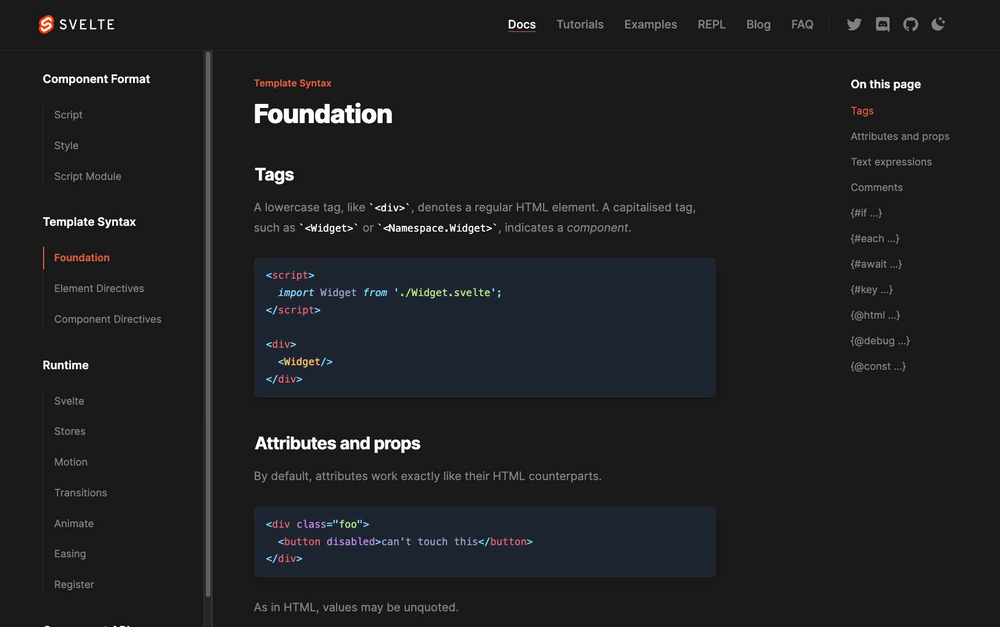

# KitDocs

[![package-badge]][package]

Documentation integration for [SvelteKit][sveltekit]. You can think of it as a
[VitePress](https://vitepress.vuejs.org) alternative for Svelte.

## ✨ Features

- 📝 Vite plugin for transforming Markdown files to Svelte components with HMR support.
- 📡 Loaders and endpoint handlers for loading Markdown metadata (i.e., title, frontmatter, etc.),
  and sidebar configurations.
- 🎨 Beautiful pre-designed theme that's inspired by the [Tailwind docs](https://tailwindcss.com/docs/installation).
- :wheelchair: Accessible menus and popovers with full keyboard support, which are included
  in the default theme and also exported for your convenience.
- 🌎 Global components folder that's imported into all Markdown files
  and also mapped to custom containers (e.g., `Button.svelte` -> `:::button`).
- 🧩 Markdown extensions for header anchors, file links, YAML frontmatter, emojis, custom
  containers, table of contents, code fences, and importing code snippets.
- 🖼️ Beautiful syntax highlighting with [Shiki](https://shiki.matsu.io). This
  includes pre-designed code blocks that support titles, line highlighting, copy code button and a
  few other goodies.
- 🏗️ Prebuilt Markdown components for steps, admonitions (i.e., callouts),
  tabbed links, responsive tables, and yes/no blocks.
- 🔎 Algolia search integration that includes a clean default design.

## 📖 Documentation

You can find our documentation at [kit-docs.svelteness.dev](https://kit-docs.svelteness.dev).

[package]: https://www.npmjs.com/package/@svelteness/kit-docs
[package-badge]: https://img.shields.io/npm/v/@svelteness/kit-docs/latest
[sveltekit]: https://kit.svelte.dev
[vite]: https://vitejs.dev

## 📝 License

KitDocs is [MIT licensed](./LICENSE).
